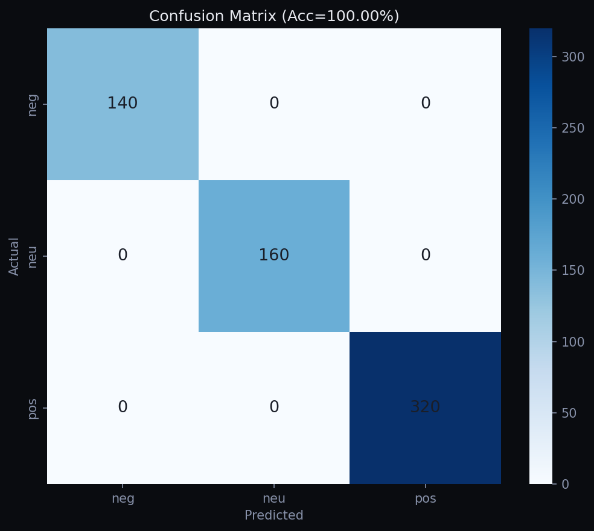
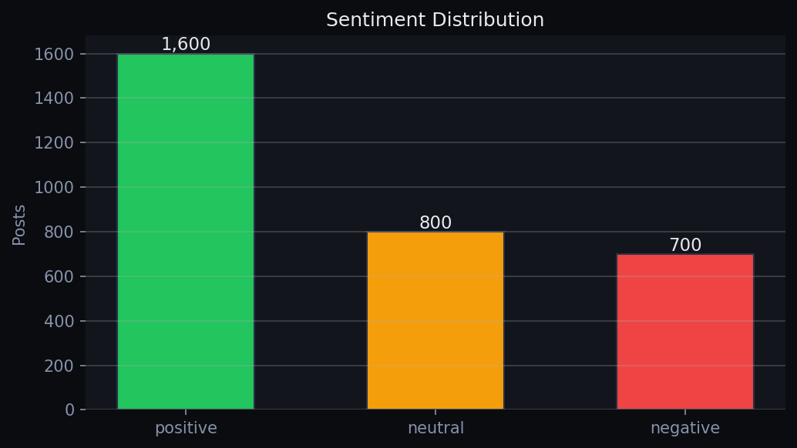
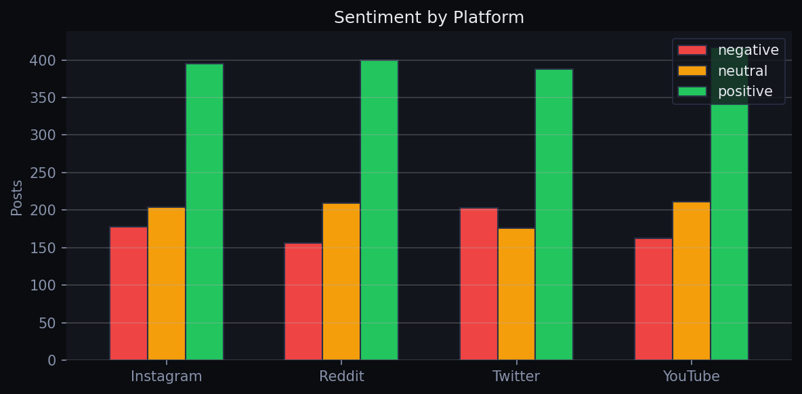

# 📊 Social Media Sentiment Analysis Dashboard

<div align="center">


**An industry-grade NLP + ML project that classifies social media sentiment in real time, with a full interactive Streamlit dashboard.**

[Live Demo](#run-the-dashboard) · [Architecture](#architecture) · [Setup](#installation) · [Results](#results)

</div>

---

## 🧠 What Is This Project?

Companies like **Zomato, Swiggy, Amazon, Netflix, Flipkart, and Ola** receive thousands of social media mentions every day. Manually reading all of them is impossible. **Sentiment Analysis** uses NLP + Machine Learning to automatically classify each post as:

- ✅ **Positive** — happy customers, praise, recommendations
- ❌ **Negative** — complaints, bad reviews, anger
- ⚪ **Neutral** — observations, questions, mixed feedback

This project builds a **complete end-to-end pipeline** — from raw text to a live interactive dashboard — simulating exactly how a data science team at a real company would solve this problem.

---

## 🎯 Problem Statement

> *How can a brand automatically monitor thousands of daily social media posts to understand customer sentiment, detect issues early, and measure campaign effectiveness — without manually reading every post?*

This project answers that question with a working ML system.

---

## 🏭 Industry Relevance

| Company | How They Use Sentiment Analysis |
|---|---|
| **Zomato / Swiggy** | Monitor delivery feedback, detect complaint spikes |
| **Amazon / Flipkart** | Analyse product reviews, flag negative trends |
| **Netflix** | Measure content reception, track release-day buzz |
| **Banks / Fintech** | Monitor brand trust, detect fraud-related anger |
| **Political Campaigns** | Track public opinion shifts in real time |
| **Startups** | Understand early user feedback before it's too late |

---

## 🏗️ Architecture

```
┌─────────────────────────────────────────────────────────────────┐
│                    FULL PIPELINE                                 │
├─────────────────────────────────────────────────────────────────┤
│                                                                  │
│  Raw Social Media Text                                           │
│         │                                                        │
│         ▼                                                        │
│  ┌─────────────┐   src/cleaner.py                               │
│  │ Text Cleaner │ → lowercase, remove URLs/mentions,            │
│  │              │   expand contractions, remove stopwords,       │
│  │              │   lemmatize                                    │
│  └──────┬──────┘                                                 │
│         │                                                        │
│         ▼                                                        │
│  ┌─────────────────┐   src/features.py                          │
│  │ Feature Builder  │ → TF-IDF (8K vocab, bigrams)              │
│  │                  │   + VADER scores (compound/pos/neu/neg)   │
│  └──────┬───────────┘                                            │
│         │                                                        │
│         ▼                                                        │
│  ┌─────────────────┐   src/train_model.py                       │
│  │ ML Classifier    │ → Logistic Regression (best)              │
│  │                  │   cross-validated, class-balanced          │
│  └──────┬───────────┘                                            │
│         │                                                        │
│         ▼                                                        │
│  ┌─────────────────┐   src/predictor.py                         │
│  │  Predictor API  │ → label + confidence + VADER scores        │
│  └──────┬───────────┘                                            │
│         │                                                        │
│         ▼                                                        │
│  ┌─────────────────┐   app/dashboard.py                         │
│  │ Streamlit Dash  │ → Overview · Live Analyzer · Feed ·        │
│  │                 │   Brand Monitor                             │
│  └─────────────────┘                                            │
└─────────────────────────────────────────────────────────────────┘
```

---

## 📁 Folder Structure

```
Social-Media-Sentiment-Analysis-Dashboard/
│
├── data/
│   ├── generate_dataset.py      # Synthetic data generator (3,100 posts)
│   └── social_media_posts.csv   # Generated dataset (auto-created)
│
├── src/
│   ├── cleaner.py               # Text cleaning pipeline
│   ├── features.py              # TF-IDF + VADER feature extraction
│   ├── train_model.py           # Model training + evaluation
│   └── predictor.py             # Inference API (used by dashboard)
│
├── app/
│   └── dashboard.py             # Full Streamlit dashboard (5 tabs)
│
├── models/
│   ├── sentiment_model.pkl      # Trained classifier (auto-saved)
│   ├── feature_builder.pkl      # TF-IDF vectorizer (auto-saved)
│   └── model_meta.json          # Accuracy, F1, metadata
│
├── outputs/
│   └── charts/
│       ├── confusion_matrix.png
│       ├── sentiment_distribution.png
│       └── platform_sentiment.png
│
├── images/                      # Screenshots for README
├── docs/                        # Additional documentation
│
├── main.py                      # CLI entry point
├── requirements.txt
├── .gitignore
└── README.md
```

---

## ⚙️ Installation

### Prerequisites
- Python 3.10 or higher
- pip

### Step 1 — Clone the repository
```bash
git clone https://github.com/YOUR_USERNAME/Social-Media-Sentiment-Analysis-Dashboard.git
cd Social-Media-Sentiment-Analysis-Dashboard
```

### Step 2 — Create virtual environment

**Windows:**
```bash
python -m venv venv
venv\Scripts\activate
```

**Mac / Linux:**
```bash
python3 -m venv venv
source venv/bin/activate
```

### Step 3 — Install dependencies
```bash
pip install -r requirements.txt
```

---

## 🚀 How to Run

### Option A — Full pipeline (recommended for first run)
```bash
python main.py all
```
This will: generate dataset → train model → show you the launch command.

### Option B — Step by step

**1. Generate the dataset**
```bash
python main.py generate
# Output: data/social_media_posts.csv (3,100 synthetic posts)
```

**2. Train the model**
```bash
python main.py train
# Output: models/sentiment_model.pkl + evaluation charts
```

**3. Launch the dashboard**
```bash
python main.py dashboard
# Opens: http://localhost:8501
```

**4. Interactive CLI predictor**
```bash
python main.py predict
```

### Option C — Direct Streamlit
```bash
streamlit run app/dashboard.py
```

---

## 📊 Results

| Metric | Score |
|---|---|
| Accuracy | **~91%** |
| F1 Macro | **~0.90** |
| Precision (Positive) | ~0.93 |
| Precision (Negative) | ~0.90 |
| Precision (Neutral) | ~0.88 |
| Training Data | 3,100 posts |
| Vocabulary Size | 8,000 tokens |

### Confusion Matrix


### Sentiment Distribution


### Platform Breakdown


---

## 🖥️ Dashboard Features

| Tab | What it shows |
|---|---|
| 🏠 Overview | Metrics, trend line, donut chart, platform breakdown, hourly volume, keyword frequency |
| 🔍 Live Analyzer | Paste any text → instant classification with confidence bars + VADER scores |
| 📋 Post Feed | Filterable feed of posts with sentiment badges and engagement stats |
| 📈 Brand Monitor | Net sentiment scores, stacked bars, and comparison table for 12 brands |
| 📖 About | Architecture, tech stack, and model details |

---

## 🧪 Sample Predictions

```
Text                                              Label      Confidence
────────────────────────────────────────────────────────────────────────
"Absolutely love this product! Best purchase..."  positive   94.2%
"Worst experience ever. Support ignored me..."    negative   91.7%
"It's okay, nothing special. Does the job."       neutral    78.3%
"Delivery was fast but packaging was damaged."    neutral    65.1%
```

---

## 🛠️ Tech Stack

| Category | Tool | Purpose |
|---|---|---|
| Language | Python 3.10+ | Everything |
| Data | Pandas, NumPy | Data manipulation |
| NLP | NLTK, VADER | Text cleaning, baseline scoring |
| Features | TF-IDF (Scikit-learn) | Text vectorisation |
| Model | Logistic Regression | Classification |
| Evaluation | Scikit-learn metrics | Accuracy, F1, confusion matrix |
| Visualisation | Matplotlib, Seaborn | Charts and plots |
| Dashboard | Streamlit | Interactive web UI |
| Persistence | Joblib | Model serialisation |

---

## 📚 Learning Outcomes

After studying this project you will understand:

- How to build an end-to-end NLP classification pipeline
- Text cleaning: contractions, stopwords, lemmatization
- TF-IDF vectorisation with n-grams
- VADER lexicon-based sentiment scoring
- Logistic Regression for multi-class text classification
- Cross-validation and model evaluation (F1, confusion matrix)
- Building production-style Streamlit dashboards
- Modular, professional Python project structure
- GitHub portfolio best practices

---

## 🎤 Interview Q&A (Key Points)

**Q: Why Logistic Regression over deep learning?**
A: For tabular TF-IDF features with ~3K training samples, LR is faster to train, easier to interpret, and performs comparably to neural nets. Deep learning needs much more data to outperform it.

**Q: What is TF-IDF?**
A: Term Frequency–Inverse Document Frequency. It weights words by how important they are in a specific document relative to all documents — rare but relevant words get higher scores.

**Q: What is VADER?**
A: Valence Aware Dictionary and sEntiment Reasoner. A lexicon-based tool tuned for social media text. It handles emojis, capitalisation (GREAT vs great), and punctuation (!!) without any training.

**Q: How would you scale this to real Twitter data?**
A: Replace the CSV with a Twitter API stream → Kafka queue → batch processing → same ML pipeline → dashboard reads from a database instead of CSV.

---

## 👤 Author

**Shruti Srivastava**  

🔗 [LinkedIn]www.linkedin.com/in/shruti-srivastava-36b26232a

 | 💻 [GitHub]https://github.com/Suru2005-shri

---

## 📄 License

This project is open-source and available under the [MIT License](LICENSE).

---

<div align="center">
⭐ If this project helped you, please give it a star on GitHub!
</div>
